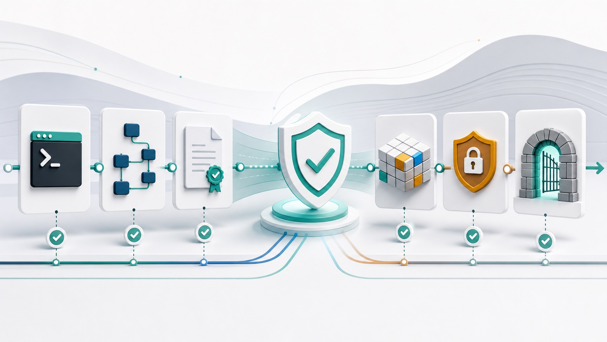

# Sneakoscope Codex

Fast legacy-free proof-first Codex trust layer with image-based Voxel TriWiki.

Sneakoscope Codex (`sks`) is a Codex CLI/App harness that makes repeatable Codex work auditable.

SKS does not try to clone every other harness. It focuses on one thing: making Codex work auditable, visual-evidence-bound, safety-gated, and reproducible through Completion Proof.

## LLM Init Prompt for Hermes / OpenClaw Agent Builders

```text
Set up this agent project with Sneakoscope Codex. Use [[mandarange/Sneakoscope-Codex](https://github.com/mandarange/Sneakoscope-Codex)] as the repo reference and [npm i -g sneakoscope] as the recommended global install command, then run the appropriate `sks` setup, doctor, Codex App, and proof checks for this repo. Keep generated SKS state out of source control unless documented, and record every version-facing change in CHANGELOG.md.
```



## Current Release

SKS **1.21.3** restores macOS native text copy in SKS-launched Zellij sessions: the generated clipboard config and launch options now set `mouse_mode false` alongside `copy_command pbcopy`, so drag-select + `Cmd+C` reaches the terminal/system clipboard instead of being intercepted by Zellij. It also keeps Team/Naruto native agents individually visible in the right-side Zellij UI by separating runtime concurrency (`target_active_slots`) from the visual lane count (`visual_lane_count`). It carries forward the 1.21.2 Zellij launch fix, 1.21.1 launch-speed fix, and Codex legacy-profile cleanup.

SKS **1.20.4** is a targeted `sks --mad` / codex-lb Zellij usability patch: when a background MAD Zellij session launches successfully, SKS now prints the exact `Attach with: ZELLIJ_SOCKET_DIR=... zellij attach ...` command so operators can enter the fresh session without manually reconstructing the socket namespace.

SKS **1.20.3** added the macOS Zellij launch fallback and project-local Fast mode control. SKS supplies a short per-user `ZELLIJ_SOCKET_DIR` by default, caps generated session names safely, records `*_command_with_env` attach commands, and classifies `IPC socket path is too long` as `zellij_socket_path_too_long` instead of a generic launch failure. It also adds `sks fast-mode on|off|status|clear`, `$Fast-On`, `$Fast-Off`, and `$Fast-Mode`; saved project preferences are used only when no explicit `--fast`, `--no-fast`, or `--service-tier` flag is present.

It carries forward the **1.20.2** stabilization layer: **Mutation Guard** routes genuinely-risky global/config/permission/package mutations through the Requested-Scope Contract + Mutation Ledger (`safety:mutation-callsite-coverage` fails any unguarded, unallowlisted risky call site); `release:check:dynamic:execute` is the real **caching gate runner** (schema v2, real/heavy gates deferred to `release:real-check`, dynamic-only cannot authorize publish); the **Core Skill** deployed snapshot is read by the route runtime and recorded in `agent-proof-evidence.json` (`selected_core_skill`), with promotions written to the mutation ledger; and `sks doctor` exposes an explicit **`zellij_readiness`** block (`zellij:doctor-readiness`). See `docs/dynamic-release-pipeline.md`.

SKS **1.20.1** introduces the **SKS Core Skill Engine** — a SkillOpt-style self-evolving skill layer — while locking the harness into a deploy-ready stable build. Skills are the agent's *external, versioned state* (Core Skill Cards): an optimizer proposes **bounded** add/delete/replace edits to a single skill document under a **textual edit budget**, edits are accepted **only on strict held-out improvement**, rejected edits are buffered so they are never retried, and the **deployed snapshot is immutable**. Critically, the optimizer runs only in training/evaluation — the **deployment/inference path reads the deployed snapshot and never makes an extra model call**, and a skill patch can never mutate code/config/package/global files.

1.20.1 also adds a **Requested-Scope Contract + Mutation Ledger** so SKS performs **no side effect the user did not request** (deny-by-default; global/destructive mutations require explicit `--yes`/env opt-in and a backup or no-op reason), and a **dynamic, risk-based release pipeline** (`release:gate-planner` builds `release-gates.json`; `release:check:dynamic` runs only P0 always-on gates plus gates whose files changed; `release:gate-budget` reports the slowest gates) so unrelated heavy gates are skipped during incremental checks while publish never skips a required gate.

It carries forward the 1.19.x hardening unchanged: legacy 1.18.x/1.19.x→1.20.1 **zero-break upgrade** (user `model`/`service_tier`/`model_reasoning_effort` and user-disabled Codex App flags never overwritten; existing skill cards preserved), the **migration transaction journal** (`.sneakoscope/reports/migration-1.20.1-journal.jsonl`), **Zellij launch-command truth** + real-session **heartbeat-timeout blocker** + the redesigned **Zellij lane UI**, **packlist/publish-performance** gates, a **postinstall safe-side-effects** gate, and the **TS source-of-truth / Rust optional-accelerator** boundary (publish never compiles Rust). `sks zellij status`/`repair` inspects the Zellij runtime without auto-installing anything.

```bash
sks mad-sks plan --target-root <path> --json
sks mad-sks permissions --json
sks mad-sks proof --json
sks mad-sks rollback-apply --rollback-plan <path> --yes --json
sks features complete --json
sks agent status latest --json
sks agent run "release review" --agents 8 --work-items 16 --concurrency 4 --mock --json
npm run source-intelligence:all-modes
npm run agent:background-terminals
npm run zellij:lane-renderer
npm run zellij:pane-proof
npm run zellij:screen-proof
npm run agent:cleanup-executor
npm run agent:cleanup-executor-v2
npm run retention:cleanup-safety
npm run agent:intelligent-work-graph
npm run agent:ast-aware-work-graph
npm run proof:fake-vs-real-policy
npm run proof:fake-real-policy-v2
npm run release:runtime-truth-matrix
npm run codex:0.134-official-compat
npm run codex:profile-primary
npm run codex:managed-proxy-env
npm run strategy:adhd-orchestrating-gate
npm run strategy:parallel-modification-plan
npm run appshots:evidence
npm run appshots:source-intelligence
npm run appshots:thread-attachment-discovery
npm run mcp:0.134-modernization
npm run mcp:readonly-runtime-scheduler
npm run codex:0.134-runner-truth
npm run source-intelligence:codex-history-search
    npm run agent:parallel-write-kernel
    npm run agent:patch-swarm-runtime-truth
    npm run agent:patch-transaction-journal
    npm run agent:patch-conflict-rebase
    npm run agent:strategy-to-patch-strict
    npm run agent:rollback-command
    npm run agent:native-cli-session-swarm
    npm run agent:native-cli-session-swarm-10
    npm run agent:native-cli-session-swarm-20
    npm run agent:no-subagent-scaling
    npm run agent:native-cli-session-proof
    npm run agent:fast-mode-default
    npm run agent:fast-mode-worker-propagation
    npm run codex:fast-mode-profile-propagation
    npm run mad-sks:fast-mode-propagation
    SKS_TEST_REAL_CODEX_PATCHES=1 npm run agent:real-codex-patch-envelope-smoke
    npm run release:gate-existence-audit
npm run route:blackbox-realism
npm run release:real-check
npm run agent:backfill-route-blackbox
npm run team:actual-route-backfill
npm run release:readiness
```

Detailed release history lives in [CHANGELOG.md](CHANGELOG.md); every version-facing change should be recorded there before release. Current release gate status lives in [docs/release-readiness.md](docs/release-readiness.md).

## Retention And Cleanup

SKS keeps durable learning context separate from disposable route work files. Durable context includes `.sneakoscope/memory/**`, shared TriWiki records, `.sneakoscope/wiki/context-pack.json`, wrongness memory, image voxels, avoidance rules, route Completion Proof, trust reports, evidence indexes, reflections, and agent proof summaries. These files are treated as the long-term learning and audit chain.

Temporary route files are cleaned after a route is closed enough to preserve its proof chain and by `sks gc`: `.sneakoscope/tmp/*`, closed mission `team-inbox/`, `bus/`, `cycles/`, `arenas/`, agent lane/worktree scratch, mission `*.stdout.log` / `*.stderr.log`, and release-parallel raw logs after their inline summaries are written into the JSON/MD report. Post-route cleanup is bounded to the completed route so large mission stores do not stall normal commands; full old/excess mission sweeping remains an explicit `sks gc` operation. Active missions, blocked-route diagnostics, and terminal transcripts stay in place so live debugging and the current route are not disrupted. Old/excess missions that contain proof or learning artifacts are compacted rather than deleted wholesale.

```bash
sks gc --dry-run --json
sks gc --json
sks stats --json
npm run retention:cleanup-safety
```

The cleanup contract is policy-backed in `.sneakoscope/policy.json`, but the default posture is now immediate cleanup for short-lived temp files while preserving long-term SKS learning and proof artifacts.

## Documentation

- Completion Proof: [docs/completion-proof.md](docs/completion-proof.md)
- TypeScript architecture: [docs/typescript-architecture.md](docs/typescript-architecture.md)
- Trust Kernel: [docs/trust-kernel.md](docs/trust-kernel.md)
- TriWiki Wrongness Memory: [docs/triwiki-wrongness-memory.md](docs/triwiki-wrongness-memory.md)
- Git collaboration: [docs/git-collaboration.md](docs/git-collaboration.md)
- Git hygiene: [docs/git-hygiene.md](docs/git-hygiene.md)
- Shared TriWiki: [docs/shared-triwiki.md](docs/shared-triwiki.md)
- Shared Wrongness Memory: [docs/shared-wrongness-memory.md](docs/shared-wrongness-memory.md)
- Git policy: [docs/git-policy.md](docs/git-policy.md)
- Wrongness Learning Loop: [docs/wrongness-learning-loop.md](docs/wrongness-learning-loop.md)
- Package boundary: [docs/package-boundary.md](docs/package-boundary.md)
- Black-box package tests: [docs/black-box-package-tests.md](docs/black-box-package-tests.md)
- Codex CLI compatibility: [docs/codex-cli-compat.md](docs/codex-cli-compat.md)
- MAD-SKS rollback: [docs/mad-sks-rollback.md](docs/mad-sks-rollback.md)
- MAD-SKS: [docs/mad-sks.md](docs/mad-sks.md)
- Permission kernel: [docs/permission-kernel.md](docs/permission-kernel.md)
- Immutable harness guard: [docs/immutable-harness-guard.md](docs/immutable-harness-guard.md)
- Codex App: [docs/codex-app.md](docs/codex-app.md)
- Core dominance: [docs/core-dominance.md](docs/core-dominance.md)
- Performance budgets: [docs/performance-budgets.md](docs/performance-budgets.md)
- Native Agent Kernel: [docs/native-agent-kernel.md](docs/native-agent-kernel.md)
- Source Intelligence Layer: [docs/source-intelligence-layer.md](docs/source-intelligence-layer.md)
- X AI / Context7 / Codex Web policy: [docs/xai-context7-codex-web-policy.md](docs/xai-context7-codex-web-policy.md)
- Main no-Scout / worker Scout policy: [docs/main-no-scout-worker-scout-policy.md](docs/main-no-scout-worker-scout-policy.md)
- Agent terminal lanes: [docs/agent-terminal-lanes.md](docs/agent-terminal-lanes.md)
- Zellij migration: [docs/migration/tmux-to-zellij.md](docs/migration/tmux-to-zellij.md)
- Real Codex dynamic smoke: [docs/real-codex-dynamic-smoke.md](docs/real-codex-dynamic-smoke.md)
- Agent cleanup executor: [docs/agent-cleanup-executor.md](docs/agent-cleanup-executor.md)
- Intelligent work graph: [docs/intelligent-work-graph.md](docs/intelligent-work-graph.md)
- Fake vs real proof policy: [docs/fake-vs-real-proof-policy.md](docs/fake-vs-real-proof-policy.md)
- Runtime truth matrix: [docs/runtime-truth-matrix.md](docs/runtime-truth-matrix.md)
- ADHD orchestration gate: [docs/adhd-orchestrating-gate.md](docs/adhd-orchestrating-gate.md)
- Strategy-first parallel write: [docs/strategy-first-parallel-write.md](docs/strategy-first-parallel-write.md)
- Appshots pipeline: [docs/appshots-pipeline.md](docs/appshots-pipeline.md)
- Appshots thread attachments: [docs/appshots-thread-attachments.md](docs/appshots-thread-attachments.md)
- MCP readOnly scheduler: [docs/mcp-readonly-scheduler.md](docs/mcp-readonly-scheduler.md)
- Parallel write agents: [docs/parallel-write-agents.md](docs/parallel-write-agents.md)
- Agent patch queue: [docs/agent-patch-queue.md](docs/agent-patch-queue.md)
- Native CLI Session Swarm: [docs/native-cli-session-swarm.md](docs/native-cli-session-swarm.md)
- No-subagent scaling: [docs/no-subagent-scaling.md](docs/no-subagent-scaling.md)
- Fast mode default and `$Fast-On`/`$Fast-Off` toggles: [docs/fast-mode-default.md](docs/fast-mode-default.md)
- Migration 1.18.7 to 1.18.8: [docs/migration-1.18.7-to-1.18.8.md](docs/migration-1.18.7-to-1.18.8.md)
- Codex official Goal mode: [docs/codex-official-goal-mode.md](docs/codex-official-goal-mode.md)
- Release parallel full coverage: [docs/release-parallel-full-coverage.md](docs/release-parallel-full-coverage.md)
- Priority closure P0-P4: [docs/priority-closure-p0-p4.md](docs/priority-closure-p0-p4.md)
- Image Voxel TriWiki: [docs/image-voxel-ledger.md](docs/image-voxel-ledger.md)
- Image Wrongness: [docs/image-wrongness.md](docs/image-wrongness.md)
- Route finalization: [docs/route-finalization.md](docs/route-finalization.md)
- Feature fixtures: [docs/feature-fixtures.md](docs/feature-fixtures.md)
- Managed paths: [docs/managed-paths.md](docs/managed-paths.md)
- Rollback: [docs/rollback.md](docs/rollback.md)
- Known gaps: [docs/known-gaps.md](docs/known-gaps.md)
- Native agent engines: [docs/native-agent-engines.md](docs/native-agent-engines.md)
- Hermetic E2E: [docs/testing-hermetic-e2e.md](docs/testing-hermetic-e2e.md)
- Pipeline architecture: [docs/pipeline-architecture.md](docs/pipeline-architecture.md)
- Rust accelerator: [docs/rust-accelerator.md](docs/rust-accelerator.md)
- Codex App Hooks/PAT: [docs/hooks-pat.md](docs/hooks-pat.md)
- codex-lb: [docs/codex-lb.md](docs/codex-lb.md)

## 60-second start

Recommended install: use the global npm package so `sks` and the Codex App `$` skills are refreshed together.

```sh
npm i -g sneakoscope
sks root
sks doctor
sks status
sks trust report latest
sks wrongness validate project --json
sks git doctor --json
sks codex compatibility --json
sks hooks warning-check --json
sks codex-app check
sks selftest --mock
sks rust smoke --json
```

## Three core promises

1. Completion Proof for every serious route
2. Image Voxel TriWiki anchors and relations for every visual route
3. Route contracts, evidence indexes, wrongness memory, trust reports, Codex App, codex-lb, hooks, Rust fallback parity, DB, route modularity, and generated fixtures verified by release gates

## Install Options

Recommended: install globally with `npm i -g sneakoscope`, then run `sks` from either a project or any global shell location:

```sh
npm i -g sneakoscope
sks root
sks doctor
```

`npm i -g sneakoscope` is the recommended install path. It automatically refreshes the `sks` command shim, global Codex App `$` skills, and SKS bootstrap surface. When the install is run from a project, postinstall bootstraps that project. When it is run outside a repo/project marker, postinstall bootstraps the per-user global runtime root instead of writing `.sneakoscope` into a random current directory. `sks root` tells you which root SKS will use.

If you only want a one-shot run without keeping `sks` installed globally:

```sh
npx -y -p sneakoscope sks root
```

For a repo-local install:

```sh
npm i -D sneakoscope
npx sks setup --install-scope project
```

Check that the install is usable:

```sh
sks deps check
sks codex-app check
sks dollar-commands
sks commit --json
sks selftest --mock
```

## What Sneakoscope Adds

`sks` adds a Zellij-backed Codex CLI runtime, Codex App `$` commands, Team/QA/PPT/Research/DB/GX/Wiki routes, OpenClaw and Hermes skill generation, Context7-gated current docs, TriWiki context packs, DB safety, design SSOT policy, skill dreaming, release checks, and Honest Mode.

## Report-Only Planning Surfaces

Decision Lattice and RecallPulse remain report-only planning and evidence surfaces. They can explain route choices and proof-debt signals, but SKS does not claim speedup, fast-lane accuracy, or reduced verification cost from them until scored evals prove those outcomes.

Useful checks:

```bash
sks proof-field scan --json --intent "small CLI change"
sks pipeline plan latest --proof-field --json
```

## Requirements

- Node.js `>=20.11`
- npm
- Codex CLI for terminal workflows
- Codex App for app-facing workflows, including Codex Computer Use and `$imagegen`/`gpt-image-2` evidence when required
- Zellij for `sks --mad` and interactive lane UI
- Context7 MCP for current-docs-gated routes

Install Zellij from [zellij.dev](https://zellij.dev/documentation/installation.html). On macOS, Homebrew users can also install it with:

```sh
brew install zellij
```

The default `sks` runtime checks npm for newer `sneakoscope` and `@openai/codex` versions before opening the interactive runtime. `npm i -g sneakoscope` runs a safe bootstrap/readiness pass; use `sks bootstrap --yes`, `sks deps check --yes`, or `sks --mad --yes` to install or repair Codex CLI/Zellij when Homebrew is available. `sks --mad` requires Zellij for interactive MAD/lane UI and prints the session, gate, attach command, blockers, and labeled Zellij stderr/stdout details needed to act.

## Installation

### Global Install

Use this recommended path when you want `sks` available from any repo:

```sh
npm i -g sneakoscope
sks root
```

`sks` commands work even when no project root is present. Project-aware commands use the nearest `.sneakoscope`, `.dcodex`, or `.git` root; if none exists, SKS uses a per-user global runtime root. Global npm install/upgrade automatically bootstraps the current project when a project marker is present, otherwise it bootstraps the global runtime root. Run `sks bootstrap` manually only when you intentionally want to initialize or repair the current project after install.

Project setup writes shared `.gitignore` entries for generated SKS files: `.sneakoscope/`, `.codex/`, `.agents/`, and managed `AGENTS.md`. Setup, doctor repair, and npm postinstall refreshes also compare the previous SKS generated-file manifest with the current package templates and prune stale SKS-generated legacy skills or agent files while preserving user-owned custom skills. Use `sks setup --local-only` when you want those excludes kept only in `.git/info/exclude`.

During npm postinstall, SKS installs generated Codex App skills and tries `skills add MohtashamMurshid/getdesign` when the `skills` CLI is available. Design work still flows through one authority: `design.md`.

### One-Shot Install

Use this when you do not want to keep a global install:

```sh
npx -y -p sneakoscope sks bootstrap
```

`npx` fetches the package into npm's cache and runs the binary for that command. This is useful for first-time setup or CI-style verification.

### Project Install

Use this when a repo should pin Sneakoscope as a development dependency:

```sh
npm i -D sneakoscope
npx sks setup --install-scope project
```

Project installs are useful when a team wants a repeatable harness version checked through `package-lock.json`.

### Source Checkout

Use this when developing Sneakoscope itself:

```sh
git clone https://github.com/mandarange/Sneakoscope-Codex.git
cd Sneakoscope-Codex
npm install
npm install -g .
sks --version
```

## Terminal CLI Usage

Use terminal commands when you want to inspect, set up, verify, or start a CLI-first workspace.

### Discovery

```sh
sks commands
sks usage install
sks usage team
sks usage codex-app
sks dollar-commands
sks --version
```

### Setup And Repair

```sh
sks bootstrap
sks deps check --yes
sks codex-app check
sks doctor --fix
sks fix-path
```

### Open Codex CLI With Zellij

```sh
sks
sks --mad
sks team open-zellij latest
sks team attach-zellij latest
```

Interactive SKS sessions use Zellij layouts. By default SKS launches Codex in Fast service tier with `--model gpt-5.5`, `-c service_tier="fast"`, and the selected `model_reasoning_effort`. SKS always forces the model to `gpt-5.5`; `SKS_CODEX_MODEL` and `SKS_CODEX_FAST_HIGH=0` cannot downgrade or remove that model pin. You can still set `SKS_CODEX_REASONING` to change reasoning effort. Use `sks --mad --workspace <name>` for an explicit MAD session and `sks help` for CLI help.

Before opening the interactive runtime, SKS checks the installed Codex CLI against npm `@openai/codex@latest`. If a newer version exists, it asks `Y/n`; answering `y` updates automatically with `npm i -g @openai/codex@latest` and then opens the runtime with the updated Codex CLI.

For [codex-lb](https://github.com/Soju06/codex-lb), start the server, create a dashboard API key, then run:

```sh
sks codex-lb setup --host https://your-codex-lb.example.com --api-key "sk-clb-..."
sks codex-lb health
sks codex-lb repair
sks
```

Bare `sks` can also prompt for codex-lb auth; SKS stores the base URL/key in `~/.codex/sks-codex-lb.env`, writes the codex-lb Codex CLI / IDE Extension provider block into `~/.codex/config.toml` for Codex App routing, loads the provider env key for interactive launches, and syncs the macOS user launch environment so the Codex App can see `CODEX_LB_API_KEY` after restart. If the provider block disappears but the stored env file is still recoverable, bare `sks`, npm postinstall upgrades, `sks doctor --fix`, and `sks codex-lb repair` restore it with `env_key = "CODEX_LB_API_KEY"`, `supports_websockets = true`, and `requires_openai_auth = false`; imagegen checks may record this provider as configured codex-lb routing, but it is not accepted as official Codex App `$imagegen` evidence. If an older SKS release left the codex-lb dashboard key only in the shared Codex `auth.json` login cache, SKS migrates that key back into `~/.codex/sks-codex-lb.env` when a codex-lb provider or env base URL is already recoverable. It does not rewrite the shared Codex `auth.json` login cache by default; set `SKS_CODEX_LB_SYNC_CODEX_LOGIN=1` only if you intentionally want the old API-key login-cache behavior. When codex-lb is active, SKS opens a fresh `sks-codex-lb-*` Zellij session and sweeps older detached codex-lb sessions for the same repo before launch so stale Responses API chains are not reused. Configured launch paths run a response-chain health check. `previous_response_not_found` is treated as a stateless-LB warning and keeps codex-lb active. Hard failures are surfaced to the user; SKS only bypasses codex-lb when the user chooses OAuth fallback or `SKS_CODEX_LB_AUTOBYPASS=1` is set.

If codex-lb provider auth drifts after launch/reinstall, run `sks doctor --fix` or `sks codex-lb repair`. To **swap only the API key** at any time (without re-typing the host — it reuses the stored base URL), run:

```sh
sks codex-lb set-key --api-key-stdin   # or: sks codex-lb set-key --api-key "sk-clb-..."
```

(To also change the host, use `sks codex-lb reconfigure --host <domain> --api-key <key>`.)

### Switching auth mode: codex-lb ↔ ChatGPT OAuth

Switch between the codex-lb API key and your ChatGPT OAuth login at any time with intent-named commands:

```sh
sks codex-lb use-oauth      # hand control back to ChatGPT OAuth
sks codex-lb use-codex-lb   # switch back to the codex-lb API key
```

`use-oauth` restores `~/.codex/auth.chatgpt-backup.json` (written by auto-reconcile) to `~/.codex/auth.json` and unsets `model_provider = "codex-lb"` so Codex CLI/App falls back to ChatGPT OAuth; if no saved OAuth login exists it points you to `codex login`. `use-codex-lb` re-selects and re-syncs codex-lb. (The older verbs `sks codex-lb release` / `repair` remain as aliases.)

Flags:

- `--keep-provider` — restore `auth.json` only; leave `model_provider = "codex-lb"` selected (advanced use).
- `--delete-backup` — remove `~/.codex/auth.chatgpt-backup.json` after a successful restore. Default is to keep it so a subsequent re-reconcile still has a source backup.
- `--force` — restore even when the current `auth.json` does not look like the codex-lb apikey shape (e.g. if you hand-edited it after reconcile).
- `--json` — machine-readable output with `status` ∈ {`released`, `no_backup`, `already_chatgpt`, `auth_in_use`, `failed`} plus `auth_path`, `backup_path`, `provider_unselected`, `backup_removed`.

`sks codex-lb status` reports whether a ChatGPT OAuth backup is present and shows the `sks codex-lb release` hint when applicable. `sks doctor` surfaces the same hint.

If Codex App shows `access token could not be refreshed` after codex-lb setup or status checks, recover the ChatGPT OAuth side without discarding codex-lb: run `sks codex-lb status`, then `sks codex-lb repair`. Repair restores a ChatGPT OAuth backup when one exists while keeping `model_provider = "codex-lb"` selected and the codex-lb key in `CODEX_LB_API_KEY`. If no OAuth backup exists, sign in again in Codex App/CLI, then rerun `sks codex-lb repair`. Use `sks codex-lb release` only when you want to switch fully away from codex-lb.

If you only want to stop routing through codex-lb without touching `auth.json`, use the lighter `sks codex-lb unselect` instead:

```sh
sks codex-lb unselect
```

This flips `model_provider` away from `codex-lb` in the top-level Codex App config while leaving your `sks-codex-lb.env` and `auth.json` untouched, so you can re-engage codex-lb later with `sks codex-lb repair` without re-running setup.

### MAD Zellij Launch

```sh
sks --mad
sks --mad --allow-package-install --allow-service-control --allow-network --yes
```

This syncs existing codex-lb provider auth, creates/uses the `sks-mad-high` high-power maintenance profile, opens the MAD-SKS permission gate for that Zellij run, and launches a Codex CLI layout. Bare `sks --mad` grants target-project file and shell scope only; add explicit `--allow-*` flags for packages, services, network, Computer Use, browser use, generated assets, file permissions, DB writes, or other high-risk scopes. MAD-SKS is not a DB-only unlock: it is explicit user authorization to widen approved target-project scopes. Catastrophic database wipe/all-row/project-management safeguards remain active, and the pipeline contract still forbids unrequested fallback implementation code.

Before launching, SKS checks npm for a newer `sneakoscope`; answer `y` to update or `n` to continue. Use `--yes` to approve missing dependency installs automatically.

### Team Missions

```sh
sks team "implement this feature"
sks team "wide refactor" executor:5 reviewer:6
sks team "max native fan-out" --agents 12
sks team watch latest
sks team lane latest --agent native_agent_1 --follow
sks team message latest --from native_agent_1 --to executor_1 --message "handoff note"
sks team cleanup-zellij latest
sks team status latest
sks team dashboard latest
sks team log latest
```

Team missions keep at least five QA/reviewer lanes active, record live events, compile runtime tasks and worker inboxes, write schema-backed effort/work-order/dashboard artifacts, and reconcile split live lanes in Zellij when available. Native analysis lanes use the agent kernel exclusively. Use `sks team watch`, `sks team lane`, `sks team message`, and `sks team cleanup-zellij` to inspect or close the live view.

### Native Multi-Session Agents

```sh
sks agent run "map the risky files" --mock --json
sks agent run "wide release audit" --route '$Release-Review' --agents 10 --concurrency 5 --mock --json
sks agent run "real one-agent smoke" --backend codex-exec --real --agents 1 --concurrency 1 --json
```

Defaults are intentionally bounded but not subagent-limited: 5 agents by default, maximum 20 native CLI worker sessions, and a separate `--concurrency` cap. When enough work exists, `--agents 10 --concurrency 10` and `--agents 20 --concurrency 20` must create 10 or 20 independent child processes using `node dist/bin/sks.js --agent worker --intake <worker-intake.json> --json`. The parent orchestrator writes `agents/agent-roster.json`, `agents/agent-effort-policy.json`, `agents/agent-task-board.json`, `agents/agent-leases.json`, `agents/agent-no-overlap-proof.json`, `agents/agent-native-cli-session-swarm.json`, `agents/native-cli-session-proof.json`, `agents/no-subagent-scaling-policy.json`, `agents/fast-mode-propagation-proof.json`, `agents/agent-cleanup.json`, and `agents/agent-proof-evidence.json` under the mission.

Native worker sessions write independent artifact directories under `agents/sessions/<slot>/gen-<n>/worker/`, including heartbeat, process report, close report, patch envelope or no-patch reason, recursion guard, and Fast mode proof. Codex internal subagent/scout events may be cockpit evidence, but they are never counted as SKS worker sessions.

Manual fan-out syntax:

- Direct agent route: `sks agent run "<task>" --agents 8 --concurrency 4 --mock --json`
- Team prompt role counts: `$Team <task> executor:8 reviewer:5`
- Team CLI flag: `sks team "<task>" --agents 8`

Effort is assigned per agent. Simple read-only/docs slices can run low, ordinary tooling and lease mapping use medium, safety/DB/schema/release lanes use high, and frontier/forensic research can escalate to xhigh. If a lease conflict, schema failure, proof blocker, DB risk, or release risk appears, the parent can escalate that lane while keeping unrelated lanes cheaper and faster.

### Naruto Shadow Clone Swarm (`$Naruto`)

`$Naruto` (影分身 / Kage Bunshin no Jutsu) is a high-scale mode of the native agent kernel for broad fan-out work — codebase-wide sweeps, parallel drafting, large audits. It lifts the standard 20-agent ceiling to **up to 100 clone sessions** (only for this route; every other route keeps the 20 cap).

```sh
sks naruto run "sweep the codebase for TODO comments and summarize"
sks naruto run "draft a unit test for every module" --clones 100
sks naruto run "demo" --clones 24 --backend fake --json   # fast, no Codex calls
sks naruto status
```

Aliases: `$ShadowClone`, `$Kagebunshin`, and the CLI flag `sks --naruto`.

- **System-aware concurrency:** `--clones N` is the total work fan-out, but `$Naruto` never spawns the whole count at once. Live concurrency is throttled to a host-safe number derived from CPU cores and free memory (heavier cap for real `codex-exec` workers, tighter packing for in-process `fake`). So `--clones 100` on a small host still processes all 100 work units while only running a safe handful at a time; the run reports when it throttles. Override with `SKS_NARUTO_MAX_CONCURRENCY=<n>`.
- **Dynamic per-clone effort (like Team):** truly simple / no-tool work runs at `low`, any tool use lifts a clone to `medium` (never high/xhigh), and every clone runs in fast service tier.
- **Safe parallel writes:** clones coordinate through the same lease-based patch-swarm (merge coordinator + conflict rebase + transaction journal) as Team.

See [docs/naruto.md](docs/naruto.md) for the full reference.

### QA, Computer Use, Goal, Research, DB, Wiki, GX

```sh
sks qa-loop prepare "http://localhost:3000"
sks qa-loop run latest --max-cycles 2
sks codex-app chrome-extension --json
sks goal create "persist this migration workflow"
sks research prepare "evaluate this approach"
sks research run latest --max-cycles 12 --cycle-timeout-minutes 120
sks research status latest
sks recallpulse run latest
sks recallpulse status latest --json
sks recallpulse governance latest --json
sks recallpulse checklist latest --json
sks db scan --json
sks wiki refresh
sks wiki sweep latest --json
sks wiki validate .sneakoscope/wiki/context-pack.json
sks harness fixture --json
sks gx init homepage
sks gx render homepage --format html
sks validate-artifacts latest --json
sks pipeline plan latest --proof-field --json
sks perf run --json
sks perf workflow --json --intent "small CLI change" --changed src/cli/main.ts,src/core/routes.ts
sks proof-field scan --json --intent "small CLI change"
sks skill-dream status
sks skill-dream run --json
sks code-structure scan --json
```

`sks research` prepares a named genius-lens agent council, requires every agent to run at `xhigh`, records one literal `Eureka!` idea per agent, runs an evidence-bound debate, and creates `research-source-skill.md` as a route-local source collection skill before synthesis. Research is not a code-change route: real runs may write only their own mission artifacts under `.sneakoscope/missions/<id>/`, and source/package/docs/config mutations block the run with `research-code-mutation-blocker.json`. The required Research persona lenses are Einstein Agent, Feynman Agent, Turing Agent, von Neumann Agent, and Skeptic Agent; they are cognitive roles, not impersonations, and `agent-ledger.json` must include `display_name`, `persona`, `persona_boundary`, `reasoning_effort`, falsifiers, cheap probes, and `challenge_or_response`. Normal Research is not a fixed three-cycle flow: it repeats source gathering, Eureka ideas, debate, falsification, and synthesis pressure until every agent records final agreement, or pauses at the explicit max-cycle safety cap with an unpassed gate. `debate-ledger.json` must include `consensus_iterations`, `unanimous_consensus`, and per-agent agreements; `research-gate.json` cannot pass until unanimous consensus is true for all agents. Normal Research is intentionally allowed to take one or two hours when the problem needs it; `--mock` is only for selftests or dry harness checks, and a real run blocks with `research-blocker.json` instead of silently substituting mock output when the Codex execution path is unavailable. The source layer contract separates latest papers, official/government or leading-institution sources, standards/primary docs, current news such as BBC/CNN/GDELT-style sources, public discourse such as X/Reddit, developer/practitioner knowledge such as Stack Overflow/GitHub, traditional background sources, and counterevidence/fact-checking; `source-ledger.json` must record layer coverage, source quality, blockers, citations, and cross-layer triangulation. Context7 is optional for `$Research` and only becomes relevant when the research topic specifically depends on package, API, framework, or SDK documentation. Research runs require `research-report.md`, `research-paper.md`, `genius-opinion-summary.md`, `research-source-skill.md`, `source-ledger.json`, `agent-ledger.json`, `debate-ledger.json`, `novelty-ledger.json`, `falsification-ledger.json`, and `research-gate.json` so they stay source-backed, adversarially checked, falsifiable, paper-ready, and clear about every agent lens opinion. `research status` reports source entries, source-layer coverage, triangulation checks, counterevidence, xhigh agent count, Eureka moments, debate exchanges, consensus iterations, unanimous consensus, paper presence/sections, genius-opinion summary coverage, agent findings, and falsification cases alongside the gate.

`sks recallpulse` is the 0.8.0 report-only RecallPulse utility. It writes `recallpulse-decision.json`, `mission-status-ledger.json`, `route-proof-capsule.json`, `evidence-envelope.json`, `recallpulse-governance-report.json`, `recallpulse-task-goal-ledger.json`, and `recallpulse-eval-report.json` for the current mission. RecallPulse does not replace route gates, Honest Mode, DB safety, imagegen evidence, or TriWiki validation; it records cache hits, hydration needs, duplicate suppression, route-governance risks, and final-summary-ready durable status so later releases can promote only measured improvements. Checklist updates are sequential: every `Txxx` row is treated as a child `$Goal` checkpoint, and `sks recallpulse checklist ... --task T001 --apply` refuses out-of-order checks unless explicitly overridden.

`sks pipeline plan` shows the active route lane, kept/skipped stages, verification commands, and no-unrequested-fallback invariant. The 0.9.0 Decision Lattice augments this planning surface with report-only A*/proof-debt evidence: frontier paths considered, the selected path, and rejected paths with rejection reasons. `sks proof-field scan` remains the lightweight rubric for small changes; risky or broad signals return to the full Team/Honest path, and no speedup claim is valid without replay or eval evidence.

### Ambiguity Questions

Clarification asks only for ambiguity that changes execution; predictable defaults are inferred and sealed. `sks skill-dream` records cheap counters and periodically writes advisory skill reports. `$Goal` controls native `/goal` persistence without replacing the selected execution route. Web, browser, localhost, website, webapp, and web-based app verification use the official Codex Chrome Extension path first; if it is not installed/enabled, SKS stops and asks the user to set it up before resuming. `$Computer-Use` / `$CU` is now reserved for native macOS, desktop-app, OS-settings, and non-web visual work.

### Create A Presentation

```text
$PPT create a customer proposal deck as HTML/PDF
```

`$PPT` seals presentation context before artifact work and grounds design in `design.md`, getdesign inputs, and source material. The route loads `imagegen`; when the sealed deck needs generated raster assets or generated slide visual critique, use Codex App `$imagegen`/`gpt-image-2` and record the real output path in the PPT image/review ledgers.

## Codex App Usage

Sneakoscope has two surfaces:

- Terminal commands such as `sks deps check`, `sks team "task"`, and `sks --mad`
- Codex App prompt commands such as `$Team`, `$DFix`, `$QA-LOOP`, and `$Wiki`

After installing, run:

```sh
sks bootstrap
sks codex-app check
sks codex-app chrome-extension --json
sks codex-app remote-control --status
sks dollar-commands
```

For headless remotely controllable Codex App/server sessions on Codex CLI 0.130.0 or newer, run:

```sh
sks codex-app remote-control -- --help
```

`sks codex-app check` reports whether the installed Codex CLI is new enough, whether the required app flags are visible, whether Fast/speed-selector config is unlocked, whether Codex App Git Actions can use Commit, Push, Commit and Push, and PR flows, whether the Codex Chrome Extension path is ready for web/browser/webapp verification, and whether installed OpenAI default plugins such as Browser, Chrome, Computer Use, Documents, Presentations, Spreadsheets, and LaTeX are enabled. `sks codex-app chrome-extension --json` is the rapid preflight for web QA/UX/browser routes. When codex-lb is configured, SKS keeps it selected as the top-level Codex App provider while still preserving required app flags and plugin settings. Codex CLI 0.130.0+ app-server/remote-control threads can pick up config changes live; older CLI/TUI sessions should still be restarted after `.codex/config.toml` or MCP/plugin changes.

For web-related verification, SKS follows the official Codex Chrome Extension setup path first: https://developers.openai.com/codex/app/chrome-extension. `$QA-LOOP`, `$UX-Review`, `$Image-UX-Review`, browser smoke, authenticated web checks, localhost checks, and web visual review must halt quickly if that extension is missing or disabled. Only after the user says the extension setup is complete should the pipeline resume. Codex Computer Use is for native Mac/non-web targets only; it must not be used as browser/web-app verification evidence.

Imagegen is a core SKS capability, not a decorative add-on. `$Image-UX-Review`, `$UX-Review`, `$Visual-Review`, `$UI-UX-Review`, and PPT generated-review paths require real Codex App `$imagegen`/`gpt-image-2` output before full visual verification can pass. For newest-model image requests, prompts should say "Use ChatGPT Images 2.0 / GPT Image 2.0 with gpt-image-2" while still invoking Codex App `$imagegen` when live generation is needed. Use `imagegen-source-scout` when current official docs plus X/social prompt-workflow signals are needed; social sources are prompt heuristics only, not capability or evidence specs. `npm run imagegen:capability` checks that the official Codex App imagegen surface is visible and records that capability detection is not output proof; OpenAI API, Responses image-generation, codex-lb, or `CODEX_LB_API_KEY` fallbacks are non-Codex paths and do not satisfy Codex App generated-image evidence unless a separate API fallback task is explicitly requested. The README architecture asset uses the same rule: run `npm run imagegen:readme-architecture:prompt` to print/write the official prompt, generate the image in Codex App `$imagegen`, then rerun `npm run imagegen:readme-architecture -- --output <path>` after Codex App creates a real gpt-image-2 output. When exactly one current generated_images candidate exists after the prompt, `npm run imagegen:readme-architecture -- --auto-pick-latest` can select it automatically. To let the verifier wait while Codex App writes the file, use `npm run imagegen:readme-architecture -- --wait-ms <milliseconds>`; it still accepts only one current candidate under `$CODEX_HOME/generated_images`. Env forms such as `SKS_CODEX_APP_IMAGEGEN_OUTPUT=<path>` remain supported for automation. Use the selected file directly under `$CODEX_HOME/generated_images`; moved or copied files are not accepted as provenance evidence. Disabled or missing `image_generation` remains a blocker that `sks codex-app check`, `npm run imagegen:capability`, and selftest cover.

Then open Codex App and use prompt commands directly in the chat. Examples:

```text
$Team implement the checkout fix and verify it
$DFix change this label and spacing only
$QA-LOOP dogfood localhost:3000 and fix safe issues
$PPT create an investor deck as HTML/PDF
$UX-Review this screenshot with gpt-image-2 callouts, then fix the issues
$Goal persist this migration workflow with native /goal continuation
$Research investigate this mechanism with source-backed agent lenses
$Wiki refresh and validate the context pack
$DB inspect this migration for destructive risk
```

Generated app files include:

| Path | Purpose |
| --- | --- |
| `.codex/SNEAKOSCOPE.md` | Codex App quick reference and route guidance. |
| `.agents/skills/` | Generated skill instructions for `$` commands. |
| `.codex/hooks.json` | Stop/finalization hooks for Honest Mode and completion summaries. |
| `.codex/config.toml` | Codex profiles, agents, and MCP configuration. |
| `.sneakoscope/` | Runtime state, missions, wiki packs, policies, and artifacts. |

Default setup adds these generated SKS paths to the project `.gitignore`; `--local-only` uses `.git/info/exclude` instead.

Use `sks dollar-commands` to confirm that terminal discovery and Codex App prompt commands agree.

SKS does not install Git pre-commit hooks. Release metadata is changed only by explicit commands such as `sks versioning bump`, and `sks versioning hook` is intentionally blocked so Codex App commit/push flows stay unobstructed.

TriWiki is intentionally sparse: `sks wiki sweep` records demote, soft-forget, archive, delete, promote-to-skill, and promote-to-rule candidates instead of injecting every old claim into future prompts. `sks harness fixture` validates the broader Harness Growth Factory contract: deliberate forgetting fixtures, skill card metadata, experiment schema, tool-error taxonomy, permission profiles, MultiAgentV2 defaults, and tmux cockpit view coverage. `sks code-structure scan` flags handwritten files above 1000/2000/3000-line thresholds so new logic can be extracted before command files become harder to maintain.

## OpenClaw And Hermes Agent Usage

Sneakoscope can generate an OpenClaw skill package for agents that need to operate SKS-enabled repositories.

```sh
sks openclaw install
sks openclaw path
```

By default this writes `~/.openclaw/skills/sneakoscope-codex/` with `manifest.yaml`, `SKILL.md`, a README, and `openclaw-agent-config.example.yaml`. Set `OPENCLAW_HOME` or pass `--dir` for a custom location. Attach the skill with the built-in `shell` tool enabled and set `SKS_OPENCLAW=1` so SKS can auto-approve update/install prompts that would otherwise wait for `Y/n`.

```sh
SKS_OPENCLAW=1 sks root
SKS_OPENCLAW=1 sks commands
SKS_OPENCLAW=1 sks dollar-commands
SKS_OPENCLAW=1 sks deps check
SKS_OPENCLAW=1 sks proof-field scan --intent "small CLI change" --changed src/cli/main.ts
```

If OpenClaw runs in a sandbox, grant shell execution only for trusted workspaces. Database, migration, and destructive work still follows SKS safety routes.

Sneakoscope can also generate a Hermes Agent skill package for the Hermes `/skills` surface.

```sh
sks hermes install
sks hermes status --json
sks hermes path
```

By default this writes `~/.hermes/skills/sneakoscope-codex/` with `SKILL.md`, a README, `hermes-config.example.yaml`, and `skill-bundle.example.yaml`. Set `HERMES_HOME` or pass `--dir` for a custom location. Hermes agents should invoke `/sneakoscope-codex` with the terminal toolset enabled and run shell commands with `SKS_HERMES=1`; this enables non-interactive dependency/update prompts while leaving SKS DB, migration, and destructive-operation safety routes intact. If you use Hermes `skills.external_dirs`, remember writable external directories can be updated by Hermes, so protect shared skill folders with filesystem permissions when needed.

```sh
SKS_HERMES=1 sks root --json
SKS_HERMES=1 sks commands --json
SKS_HERMES=1 sks dollar-commands --json
SKS_HERMES=1 sks status --json
```

## Prompt `$` Commands

Use these inside Codex App or another agent prompt. They are prompt commands, not terminal commands.

Common prompts: `$Team`, `$From-Chat-IMG`, `$DFix`, `$Answer`, `$SKS`, `$QA-LOOP`, `$PPT`, `$Computer-Use`/`$CU`, `$Goal`, `$Research`, `$AutoResearch`, `$DB`, `$MAD-SKS`, `$GX`, `$Wiki`, and `$Help`.

## Common Workflows

First install:

```sh
npm i -g sneakoscope
sks bootstrap
sks deps check --yes
sks codex-app check
sks selftest --mock
```

Start a CLI workspace:

```sh
sks --mad
sks
# or: sks --mad
```

Use Codex App routes with `$Team`, `$DFix`, `$QA-LOOP`, `$PPT`, `$Goal`, `$Wiki`, and `$DB`. Team missions write artifacts under `.sneakoscope/missions/`; validate them with `sks validate-artifacts latest`.

Refresh context before risky work:

```sh
sks wiki refresh
sks wiki validate .sneakoscope/wiki/context-pack.json
```

## Safety Model

Sneakoscope intentionally treats these as high-risk:

- SQL and migrations
- Supabase MCP and RLS changes
- destructive filesystem operations
- user-global harness config
- published package/release state

By default, SKS favors inspection, local files, branch-safe changes, explicit confirmation for destructive DB operations, and completion claims backed by tests or artifacts.

## Troubleshooting

### `sks` points to an old version

```sh
which sks
sks --version
node ./dist/bin/sks.js --version
npm install -g .
```

If stale, reinstall globally from the repo or npm.

### Zellij is missing

```sh
brew install zellij
npm run zellij:capability
```

Install Zellij from [zellij.dev](https://zellij.dev/documentation/installation.html), then run `npm run zellij:capability` or `sks doctor --json`. Without Zellij, non-interactive checks can continue, but `sks --mad` and interactive lane UI report `mad_ready: false`.

### Codex App tools are missing

```sh
sks codex-app check
codex mcp list
```

Codex App workflows need the app installed. Web/browser evidence requires the Codex Chrome Extension path, native Mac/non-web visual evidence requires first-party Codex Computer Use, and generated raster/image-review evidence requires real `$imagegen`/`gpt-image-2` output. After setup/upgrade, start a fresh thread so Codex reloads plugin tools.

### Codex App commit/push is blocked

```sh
sks doctor --fix
sks codex-app check
```

`sks codex-app check` now prints `Git Actions`. It should be `ok` for Codex App Commit, Push, Commit and Push, and PR buttons to bypass SKS route gates. If it is blocked, repair config with `sks doctor --fix`; if the blocker mentions remote-control, update Codex CLI to `0.130.0` or newer and restart older app-server/TUI sessions.

### Codex App UI looks stale after codex-lb changes

If Codex App UI panels or auth-dependent controls still look wrong after codex-lb setup, repair, or upgrade, restart the app first. If the UI still does not recover, sign out of Codex App, sign back in, then run `sks codex-app check` or `sks codex-lb repair` as needed.

### Setup is blocked by another harness

```sh
sks conflicts check
sks conflicts prompt
```

OMX/DCodex conflicts block setup/doctor until the user approves cleanup.

### The route is stuck or a final hook keeps reopening

```sh
sks pipeline status --json
sks team watch latest
sks team lane latest --agent parent_orchestrator --follow
sks wiki validate .sneakoscope/wiki/context-pack.json
```

Finalization requires evidence, valid Team cleanup artifacts, reflection when required, and Honest Mode.

## Development And Release

Run local checks:

```sh
npm run repo-audit
npm run changelog:check
npm run packcheck
npm run feature:check
npm run all-features:selftest
npm run selftest
npm run sizecheck
npm run registry:check
npm run release:check
npm run publish:dry
```

`release:check` runs the current 1.20.x release-closure DAG, writes a source digest stamp under `.sneakoscope/reports/`, then refreshes release readiness so publish commands can verify the same stamp. The DAG preserves the 1.18 baseline gates and adds patch swarm runtime truth, transaction journaling, serial conflict rebase, strict strategy-to-patch proof, rollback command proof, Native CLI Session Swarm 5/10/20-process proof, Real Worker Backend Router proof, Codex child overlap proof, model-authored patch-envelope separation, Zellij layout/pane/screen/socket-dir proof, no-subagent-scaling proof, Fast mode default/worker/Codex/MAD propagation proof, Appshots attachment provenance, MCP runtime overlap evidence, Codex 0.134/0.135 runner truth, task graph expansion, schema-bound follow-up work, actual Agent/Team/Research/QA route blackboxes, scheduler proof hardening, Source Intelligence propagation, and Goal mode propagation checks. Broader live gates remain explicit scripts such as `release:real-check`; real Codex patch smoke, real Codex parallel worker proof, and real Zellij proof are optional unless their `SKS_REQUIRE_REAL_*` or `SKS_REQUIRE_ZELLIJ=1` environment variables are set. Generate the human-readable registry with `sks features inventory --write-docs`. Plain `npm publish` uses the `latest` dist-tag. npm's `prepublishOnly` verifies the fresh release stamp instead of rerunning the full gate, and `prepack` only rebuilds `dist`; publish no longer repeats the expensive release suite during packaging. `npm run publish:dry` remains the explicit dry-run helper.

Version bumps are manual. Run `sks versioning bump` only when preparing release metadata; SKS will not create `.git/hooks/pre-commit` or auto-bump during ordinary commits.

## License

MIT
