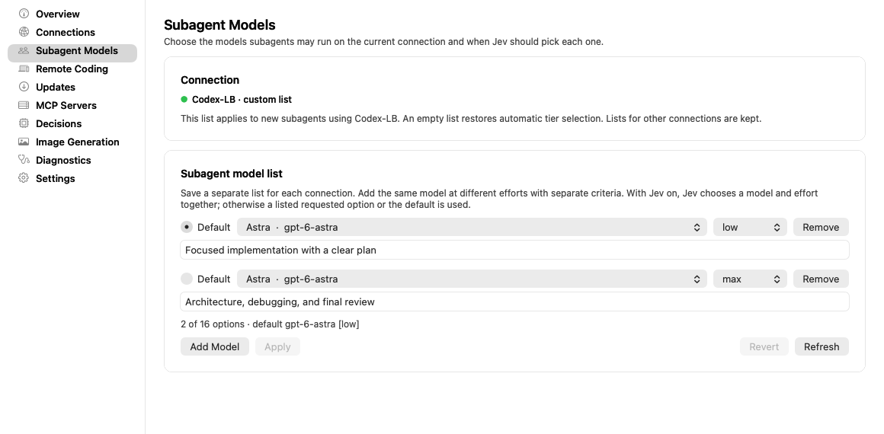

<div align="center">


# Sneakoscope Codex

**Make Codex work explainable, bounded, and test-backed.**

[](https://github.com/mandarange/Sneakoscope-Codex/actions/workflows/ci.yml)
[](https://www.npmjs.com/package/sneakoscope)
[](#requirements)
[](LICENSE)

</div>

<!-- BEGIN SKS SEARCH VISIBILITY MARKETING -->
Sneakoscope Codex (`sks`) is an open-source local tool for the Codex CLI and Codex desktop app. It adds a macOS control center, bounded agent workflows, repository context, and evidence checks for SKS releases.
<!-- END SKS SEARCH VISIBILITY MARKETING -->

Current package: **SKS 10.5.7**, published on npm.
[Release notes](https://github.com/mandarange/Sneakoscope-Codex/releases/tag/v10.5.7)
· [Changelog](CHANGELOG.md). Install the latest stable release from npm.

Ordinary work stays with the main agent. Optional Jev decisions use OpenRouter
with cloud consent; source indexing and safety checks run locally. The default
`essential` verification profile keeps safety checks active without requiring
completion-proof rituals on every turn. `strict` adds those checks. SKS's npm
release workflow requires its own current test and artifact evidence in either
profile. See [verification profiles](docs/essential-trust.md).

## SKS Center — one place for your Codex setup

On macOS, **SKS Center** puts connections, subagent model choices, updates,
and diagnostics in a native menu bar app. Open the SKS menu bar icon and choose
**Open SKS Control Center…** to manage your setup without memorizing CLI commands.



*Native SKS Center UI with an example configuration. Models and available
reasoning efforts depend on your connection's current catalog.*

| Page | What you can manage |
| --- | --- |
| **Connections** | Codex-LB, OpenAI OAuth, OpenRouter, and model visibility. |
| **Subagent Models** | Separate lists per connection, a default option, reasoning effort, and criteria for Jev. The same model can have different efforts for different work. |
| **Decisions** | Jev's decision mode and cloud consent. |
| **Settings** | Naruto's execution preference and app settings. |
| **Image Generation** | Image mode, supported model choices, and provider setup. |
| **MCP Servers** | Connected tools and server configuration. |
| **Updates & Diagnostics** | Available updates, operation progress, logs, and health checks. |

After installing SKS, install or rebuild the macOS app with:

```sh
sks menubar install
```

Interactive global macOS installs can build it automatically. Dependency, CI, and
piped installs skip the menu bar setup; scripts can opt in with
`SKS_POSTINSTALL_MENUBAR=1` or opt out with `SKS_POSTINSTALL_NO_MENUBAR=1`.
See [connection setup](docs/codex-lb.md), [subagent model lists](docs/naruto.md#connection-specific-subagent-lists),
and [image generation](docs/image-generation.md) for the underlying settings.

## Quick start

### Requirements

- **Recommended: the latest patch release of Node.js 24 LTS.** Get it from the [official Node.js releases](https://nodejs.org/en/about/previous-releases).
- npm, Git, and a current Codex CLI or supported Codex desktop host.
- Building SKS Center on macOS also requires Xcode Command Line Tools and Swift;
  the installer reports `xcode-select --install` if the tools are missing.
- For source development and tests, see the locked dependency compatibility ranges in [Contributing](CONTRIBUTING.md#local-setup). CI uses the 24.x line.

The published CLI's declared `package.json` engine floor is still `>=20.11`.
That is separate from the development/test requirements above; Node 20 is now
end-of-life, so use a supported LTS release for a new installation.

### Install SKS globally

Install SKS once for your user account so `sks` is available across projects:

```sh
npm install --global sneakoscope@latest
sks doctor --fix --global-only --yes
sks --version
```

Run these commands in your terminal. The global-only Doctor step reconciles
user-level SKS skills and configuration, and reports any setup blockers.
Make sure your npm global binary directory is on `PATH`.

Alternatively, the verified installer performs the global npm installation,
runs Doctor, and checks that `sks` on `PATH` resolves to the installed version:

```sh
npm exec --yes --package=sneakoscope@latest -- sneakoscope install --yes
```

### Add project context

Global SKS hooks and skills apply across projects. From a project root, create
its local context and ignore rules with:

```sh
sks bootstrap
sks doctor --json
```

Then open the project in Codex. Refresh its context and ask for ordinary work
directly in the conversation:

```text
$sks-align
Fix the failing test and verify the changed behavior.
$sks-review
```

`sks bootstrap` initializes the project's SKS files. `$sks-align` builds the
source index and refreshes managed guidance. Choose `$sks-naruto` or `$sks-work`
when you explicitly want child agents; enabled Jev can also select parallel
work when it judges that the task has independent parts.

## Update an existing installation

Run this from your project root in a terminal:

```sh
sks update
sks --version
sks doctor --json
```

`sks update` updates the **global** SKS package, verifies the installed command,
and reconciles SKS-managed skills, hooks, configuration and SKS Center where
available. In 10.5.5 and later it also repairs the known ignored Codex settings
and refreshes managed guidance. User-authored text and explicit preferences
are preserved. If a step fails, follow the recovery action in its output.

To check available updates first, run `sks update check`. For a repair without
requesting a newer package, run `sks doctor --fix` yourself in the terminal.

## What you get

| Need | SKS provides |
| --- | --- |
| Keep work focused | Answers, tiny edits, ordinary implementation, reviews, and DB work run directly in the main agent. Naruto delegates through official Codex subagents when explicitly requested or selected by Jev. |
| Keep context bounded | TriWiki indexes repository code into context that can be checked against source. |
| Reuse project memory | Opt-in Jev intake stages mission candidates; explicit promotion validates durable records separately from the code index. |
| Know what actually ran | Diagnostics report measured checks; release gates bind tests and package evidence to the candidate commit. |
| Recover safely | Doctor and update flows report a concrete recovery action when a check needs attention. |
| Operate locally | The CLI works without a hosted control plane; macOS users can also use SKS Center. |

`$sks-align` refreshes the thin managed guidance against current official Codex
references and rebuilds TriWiki. Update and user-run `sks doctor --fix` share
that maintenance and repair known ignored configuration settings. User text
and model choices are preserved. See [harness maintenance](docs/align-modernization.md).

### New in 10.5.7

- **Jev execution profiles:** a decision can propose a bounded execution plan.
  The default policy is `baseline`; fast profiles require `optimize` and an
  explicit profile list. Required safety and mutation stages stay code-owned.
- **TriWiki memory:** eligible mission candidates can be staged and explicitly
  promoted into durable records after provenance, scope, lifecycle, and
  evidence checks. Intake and promotion are separate opt-ins.
- **Reliable index refresh:** align preserves canonical memory, and rebuilding
  the generated memory indexes no longer makes a freshly aligned graph stale.

These are implementation and validation results, not a measured speed or model
quality improvement. See the [Jev and memory guide](docs/jev-triwiki-memory.md).

## Everyday commands

### Core dollar commands

Type these into the **Codex desktop app or Codex CLI conversation**:

| Command | Use it for |
| --- | --- |
| `$sks-align` | Refresh official guidance and rebuild TriWiki from the current codebase. |
| `$sks-mad-sks "scope and task"` | Explicitly authorize a bounded high-risk task; combine with another dollar command when appropriate. |
| `$sks-plan "task"` | Write a plan without editing product code. |
| `$sks-work` | Run parallel child work through the Naruto execution alias. |
| `$sks-review` | Review the current changes. |
| `$sks-naruto "task"` | Explicitly split independent work across official subagents. |
| `$sks-help` | Explore available SKS workflows. |

#### `$sks-align`: keep the harness and project context current

Use it when starting in a repository, after structural code changes, or when
you want to refresh the managed instructions against current official guidance:

```text
$sks-align
```

Align searches current official Codex/model guidance, refreshes only
SKS-managed instruction areas, and rebuilds the source-only TriWiki index.
Your own instructions and model choices are preserved. External references
stay separate from code facts; unavailable retrieval is reported while the
previous references are retained. See [harness maintenance](docs/align-modernization.md).

#### `$sks-mad-sks`: explicitly authorize a scoped high-risk task

Name the target, allowed changes and boundaries in the request. For example:

```text
$sks-mad-sks Fix permissions only under ./dist so this project's build can run.
Preserve source files, credentials, and other projects.
```

It temporarily widens only the approved scopes for that invocation and can
be combined with another dollar command, such as `$sks-db` for an explicitly
authorized database task. Database work uses the bound
project's SQL-plane capability, read-back verification and final read-only
restoration. Host approval boundaries and protected control-plane operations
remain enforced. See [MAD-SKS](docs/mad-sks.md) before authorizing such work.

### Terminal commands

```sh
sks --help
sks status --json
sks doctor --json
sks update check
sks update
```

Naruto runs only when you invoke `$sks-naruto` or `$sks-work`, pass `--agents N`, or ask for subagents or parallel work in so many words (a word like "parallel" in a file name is not a request); with Jev mode on, Jev may also judge that a task splits into independent parts. Ordinary fixes, tests, refactors, reviews, and DB work stay with the main agent by default. See the [Naruto guide](docs/naruto.md).

## How the trust loop works

1. **Plan** — describe the outcome and the evidence it needs.
2. **Build** — make the smallest change that satisfies the plan.
3. **Verify** — run the project checks and SKS diagnostics.
4. **Review** — inspect the diff and the evidence before claiming completion.

Inspect the actual checks and their scope before relying on a result. A passing
fixture, configured integration, or successful build does not establish a live
provider result or deployment.

## Optional integrations

### Jev decisions and memory

Jev is **off by default**. It requires an OpenRouter key and explicit cloud
consent. Configure the connection in SKS Center, then use **Decisions** or the
CLI to enable it:

```sh
sks decision status --json
sks decision enable --provider openrouter --model typesafe/jev-1.13 --consent-cloud --json
```

`status` makes no OpenRouter request. Enabling Jev permits bounded decision
requests, which may contain redacted task text and selected source excerpts;
the `baseline` execution policy and disabled memory options remain the defaults.

Advanced settings are CLI options: `--execution-policy observe` keeps baseline
execution; `--execution-policy optimize --profiles <ids>` permits selected fast
profiles when their preconditions pass. `--memory-intake` enables eligible
mission candidates; `--memory-promotion` additionally permits an explicit
`sks memory promote --mission <id> --yes` under the `optimize` policy.
User-scoped memory additionally requires `--allow-user-memory`.
Re-running `decision enable` without these flags resets them to their defaults.

Use `sks memory recall --json` to inspect available records. Disabling Jev with
`sks decision disable` stops its decision and intake paths without deleting
canonical memory. See [Jev setup](docs/jev-decisions.md) and
[memory boundaries](docs/jev-triwiki-memory.md) before enabling advanced options.

### Desktop Bridge

The Desktop Bridge can route eligible models through Codex-LB or OpenRouter while keeping provider choice and session pins explicit:

```sh
sks bridge auth-priority status --json
sks bridge auth-priority on --json
sks bridge status --json
```

Enter credentials only through the native connection dialog or an explicit `--api-key-stdin` flow. See [Codex-LB guidance](docs/codex-lb.md) and [OpenRouter Only Mode](docs/openrouter-only-mode.md).

### Image generation

SKS records which image mode produced an artifact and keeps the default Codex image route available:

```sh
sks imagegen status --json
sks imagegen models --json
sks imagegen generate --prompt "App icon, flat, blue" --out icon.png
```

See [Image generation](docs/image-generation.md) for provider boundaries and evidence sidecars.

## Documentation

- [Product contract](docs/PRODUCT-CONTRACT.md) — supported surfaces and ownership.
- [Essential Trust](docs/essential-trust.md) — verification profiles and safety boundaries.
- [Harness maintenance and Align](docs/align-modernization.md) — current official references, thin managed instructions, and source-only TriWiki.
- [MAD-SKS](docs/mad-sks.md) — explicit permission scope, execution boundaries, and verification.
- [Agent Bridge](docs/AGENT-BRIDGE.md) — integrate through the CLI or MCP interface.
- [Context Graph](docs/architecture/context-graph.md) — bounded source lookup and freshness.
- [Jev decisions](docs/jev-decisions.md) — optional cloud decisions, setup, and fallback behavior.
- [Jev and TriWiki memory](docs/jev-triwiki-memory.md) — execution profiles, memory intake, explicit promotion, and bounded recall.
- [Release readiness](docs/release-readiness.md) — build, verify, and publish a release.
- [Release evidence](docs/release-proof-truth.md) — what each verification result proves.
- [FAQ](docs/faq.md) — common setup questions.
- [Troubleshooting](docs/troubleshooting.md) — concrete recovery paths.
- [Changelog](CHANGELOG.md) — changes by version.

## FAQ and troubleshooting

### Does SKS send my source code to a hosted service?

TriWiki builds its code index locally. Codex sends the context needed for its
work to the configured model provider; optional Jev can send bounded, redacted
task text and selected source excerpts to OpenRouter after cloud consent.
Local indexing is not a promise that the whole session stays offline. Inspect
your provider and decision settings before using sensitive repositories.

### Why does `sks doctor` report a problem after an update?

Run `sks doctor --json`, read the reported recovery action, and run that action exactly. If the issue remains, capture the command, operating system, Node.js version, and redacted JSON in a bug report.

### How do I turn off experimental context management?

In SKS Center, open **Settings → Context management**, or run:

```sh
sks codex-app context-management off
```

Start a new Codex task after changing the setting. Availability depends on the Codex client and account session.

### Why is the menu bar app missing?

The native Center is macOS-only. Run `sks menubar install` from an interactive terminal, then run `sks doctor --json`. Linux and Windows CLI support is best-effort.

### Does SKS guarantee better AI output or search visibility?

No. SKS checks defined safety and evidence contracts. It does not guarantee
model quality, faster execution, rankings, traffic, or correctness beyond the
checks that actually ran.

For a reproducible issue, use the [bug report form](https://github.com/mandarange/Sneakoscope-Codex/issues/new?template=bug_report.yml). For a question, start a discussion or open an issue with the smallest redacted reproduction.

## Development

```sh
npm ci --ignore-scripts
npm run build
npm run typecheck
npm test
```

Read [CONTRIBUTING.md](CONTRIBUTING.md) before opening a pull request. Release work follows [release readiness](docs/release-readiness.md); do not publish a package from an unverified working tree.

## Support and security

- Bug reports: [issue form](https://github.com/mandarange/Sneakoscope-Codex/issues/new?template=bug_report.yml)
- Feature ideas: [feature form](https://github.com/mandarange/Sneakoscope-Codex/issues/new?template=feature_request.yml)
- Security reports: see [SECURITY.md](SECURITY.md)

## License

[MIT](LICENSE)
