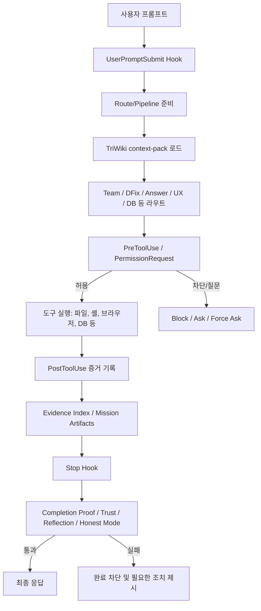
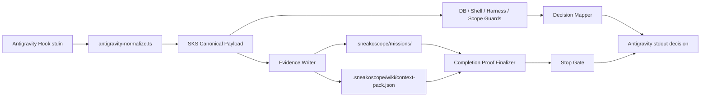

# Antigravity 2.0 이식을 위한 Sneakoscope-Codex 구조 설명서

작성일: 2026-06-02
대상: Antigravity 2.0 환경으로 SKS/Sneakoscope-Codex의 감시, 위키, 증거, 차단, 자동 수정 개념을 이식하려는 구현 담당자

## 1. 한 줄 요약

Sneakoscope-Codex, 이하 SKS는 에이전트가 파일, 셸, 데이터베이스, 패키지, 브라우저/앱, 증거 산출물에 영향을 주기 전후로 훅을 걸어 "요청 범위 안의 안전한 작업인지"와 "완료라고 말할 증거가 있는지"를 검증하는 에이전트 안전 실행 커널이다.

핵심은 네 가지다.

- 실행 전 차단: 위험한 명령, DB 쓰기, 보호된 하네스 파일 수정, 범위 밖 변이를 사전에 막는다.
- 실행 후 증거화: 도구 호출 결과, 파일 변경, 테스트, 리뷰, 이미지 앵커, 에이전트 산출물을 경로와 해시 기반 증거로 남긴다.
- TriWiki 기억 시스템: 긴 미션에서 필요한 프로젝트 지식과 과거 오류를 낮은 토큰으로 재사용하되, 위험한 판단 전에는 원본 파일에서 재수화한다.
- 완료 게이트: Team, UX Review, Research 같은 무거운 라우트는 proof, trust report, evidence index, reflection, Honest Mode가 통과해야 최종 응답을 허용한다.

## 2. 현재 구현의 큰 구조



주요 코드 경로는 아래와 같다.

- 훅 등록: `.codex/hooks.json`
- 훅 런타임: `src/core/hooks-runtime.ts`
- Codex 훅 출력 호환 레이어: `src/core/codex-compat/codex-hook-output-builders.ts`
- DB 안전: `src/core/db-safety.ts`
- 설치 하네스 보호: `src/core/harness-guard.ts`
- 요청 범위 계약과 변이 장부: `src/core/safety/requested-scope-contract.ts`, `src/core/safety/mutation-ledger.ts`, `src/core/safety/mutation-guard.ts`
- 셸 위험 분류: `src/core/mad-sks/shell-argv-classifier.ts`
- 증거 라우터: `src/core/evidence/evidence-router.ts`
- 완료 증명 게이트: `src/core/proof/route-proof-gate.ts`
- Zellij/병렬 레인 런타임: `src/core/zellij/zellij-lane-runtime.ts`
- 에이전트 패치 봉투와 적용 워커: `src/core/agents/agent-patch-schema.ts`, `src/core/agents/agent-patch-apply-worker.ts`
- TriWiki 런타임 문서: `docs/voxel-triwiki.md`, `docs/triwiki-runtime-state.md`
- Team 모드 문서: `docs/team-mode.md`
- Completion Proof 문서: `docs/completion-proof.md`

## 3. 코어 탐지 메커니즘

### 3.1 무엇을 어떻게 포착하는가

현재 SKS는 전역 파일 워처나 Git hook 강제 주입이 아니라 Codex App/CLI 훅을 중심으로 포착한다.

등록된 훅은 다음 계층이다.

- `UserPromptSubmit`: 사용자 요청이 들어온 직후 라우트와 컨텍스트를 결정한다.
- `PreToolUse`: 파일 수정, 셸 실행, 브라우저, MCP, 기타 도구 실행 직전에 검사한다.
- `PermissionRequest`: 도구 권한 요청 단계에서 허용/거부를 결정한다.
- `PostToolUse`: 도구 실행 이후 결과를 증거로 기록하고 추가 컨텍스트를 주입한다.
- `Stop`: 최종 응답 직전에 완료 증명과 라우트 게이트를 검사한다.
- `SessionStart`, `PreCompact`, `PostCompact`, `SubagentStart`, `SubagentStop`: 세션 시작, 압축, 서브에이전트 라이프사이클을 기록한다.

중요한 부정확성 방지 포인트:

- SKS는 Git pre-commit hook을 자동 설치하지 않는다.
- SKS는 기본적으로 `chokidar` 같은 상시 파일 감시자가 아니라 훅 이벤트와 실행 장부를 기준으로 판단한다.
- 패키지 설치나 글로벌 설정 변경은 사용자가 요청한 범위 계약 안에 들어오고 명시 확인이 있을 때만 허용하는 방식이다.

Antigravity 2.0으로 옮길 때도 이 방향을 유지하는 것이 좋다. 즉 "상시 감시 데몬"보다 "에이전트 실행 루프의 도구 호출 전후 인터셉트"를 1차 표면으로 삼는다.

### 3.2 분석 엔진으로 넘어가는 Payload

Codex 쪽 SKS 훅 런타임은 stdin JSON을 읽고 이벤트별 표준 payload로 평가한다. 현재 런타임은 다음 계열의 필드를 사용한다.

- 공통 메타데이터: `cwd`, `hook_event_name`, `model`, `permission_mode`, `session_id`, `transcript_path`, `turn_id`
- 사용자 프롬프트: `prompt`, `user_prompt`, `message`
- 도구 호출: `tool_name`, `tool_input`, `toolInput`, `input`, `tool.input`
- 셸 명령: `command`, `tool_input.command`, `input.command`
- 도구 결과: `tool_response`, `toolResponse`, `result`, `exit_code`, `success`
- Stop 단계: `last_assistant_message`, `assistant_message`, `response`

분석 엔진은 전체 파일을 매번 무조건 넘기는 구조가 아니다. 도구 입력에 들어온 파일 경로, 수정 내용, 셸 명령 문자열, DB 관련 SQL/CLI, 도구 결과, evidence 후보 경로를 이벤트별로 해석한다. 파일 자체 증거는 이후 evidence index에서 경로, freshness, 해시, secret 여부로 재검증한다.

Antigravity 쪽 공식 Hook 문서 기준으로는 stdin payload에 `conversationId`, `workspacePaths`, `transcriptPath`, `artifactDirectoryPath`, `toolCall.name`, `toolCall.args`, `stepIdx` 등이 들어온다. 따라서 이식 시에는 아래처럼 Antigravity payload를 SKS canonical payload로 정규화하면 된다.

```ts
export interface SksCanonicalHookPayload {
  surface: 'codex' | 'antigravity'
  event: 'UserPromptSubmit' | 'PreToolUse' | 'PostToolUse' | 'PermissionRequest' | 'Stop'
  cwd: string
  workspacePaths: string[]
  transcriptPath?: string
  artifactDirectoryPath?: string
  conversationId?: string
  sessionId?: string
  turnId?: string
  toolName?: string
  toolInput?: Record<string, unknown>
  toolResponse?: Record<string, unknown>
  command?: string
  fileTargets?: string[]
  prompt?: string
  lastAssistantMessage?: string
}
```

Antigravity file tool 인자는 다음처럼 매핑한다.

- `write_to_file.args.TargetFile` -> `fileTargets[]`
- `write_to_file.args.CodeContent` -> `toolInput.content`
- `replace_file_content.args.TargetFile` -> `fileTargets[]`
- `replace_file_content.args.TargetContent` / `ReplacementContent` -> diff 후보
- `multi_replace_file_content.args.ReplacementChunks` -> 다중 변경 후보
- `run_command.args.CommandLine` -> `command`
- `run_command.args.Cwd` -> `cwd`

## 4. 위험한 기운의 정의

SKS가 중요하게 보는 위험은 "악성 코드"만이 아니다. 더 넓게는 에이전트가 사용자의 요청 밖에서 되돌리기 어렵거나 증명 불가능한 부작용을 만드는 상황이다.

### 4.1 DB 위험

`src/core/db-safety.ts`의 기본 정책은 read-only default다.

주요 차단 패턴:

- `drop database`, `drop schema`, `drop table`, `drop view`, `drop extension`, `drop policy`
- `truncate`
- `delete from` without `where`
- `update ... set` without `where`
- `alter table ... drop`
- `create or replace`
- `disable row level security`, `disable rls`
- `grant`, `revoke`
- `supabase db reset`
- `supabase db push`
- `supabase migration repair`
- `prisma migrate reset`, `prisma db push`
- `drizzle-kit push`
- migration rollback류 명령

읽기 쿼리도 `select *` without `limit` 같은 경우에는 주의 사유를 남긴다.

### 4.2 보호된 하네스 파일 위험

설치된 SKS 하네스 제어 파일은 LLM 도구 수정 금지 대상이다.

보호되는 대표 경로:

- `.codex/config.toml`
- `.codex/hooks.json`
- `.codex/SNEAKOSCOPE.md`
- `AGENTS.md`
- `.sneakoscope/manifest.json`
- `.sneakoscope/policy.json`
- `.sneakoscope/db-safety.json`
- `.sneakoscope/harness-guard.json`
- `.agents/skills/`
- `.codex/agents/`
- `node_modules/sneakoscope/`

단, Sneakoscope 엔진 소스 레포 자체는 예외다. 현재 레포처럼 `package.name=sneakoscope`, `src/bin/sks.ts`, `src/core/init.ts`, `src/core/hooks-runtime.ts`가 있는 경우에는 엔진 구현 변경을 허용한다. 설치 대상 프로젝트에서는 위 파일들이 잠긴다.

### 4.3 요청 범위 밖 변이

기본 Requested Scope Contract는 프로젝트 파일만 허용하고 다음 변이는 명시 확인 없이는 거부한다.

- 글로벌 Codex 설정 변경
- 패키지 설치/삭제/업데이트
- Codex App 프로세스 조작
- Codex LB 인증 변경
- Zellij 설치
- 네트워크 권한 확대
- 스킬 스냅샷 승격

모든 변이는 mutation ledger에 남기는 것이 원칙이다.

대표 mutation 종류:

- `file_write`
- `file_delete`
- `file_rename`
- `chmod`
- `chflags`
- `xattr`
- `global_config_write`
- `package_install`
- `process_kill`
- `codex_app_flag_change`
- `codex_lb_auth_change`
- `zellij_install`
- `database_write`
- `skill_snapshot_promotion`

### 4.4 셸 명령 위험

셸 classifier는 다음 신호를 위험으로 본다.

- `sudo`, `su`
- `rm -r`, `rm -rf`
- `chmod`, `chown`
- `git reset --hard`
- `git clean`
- `;`, `&&`, `||`, `|`, redirect, command substitution, backtick
- 환경 변수 대입/확장
- glob expansion
- target root 밖의 cwd
- 보호된 core path 언급
- package manager install/remove/update
- service control
- DB write로 라우팅되는 명령

분류 결과는 대략 `allow`, `confirm`, `route`, `block` 네 가지로 해석된다.

### 4.5 비밀값과 증거 오염

비밀값은 증거에 평문으로 남으면 안 된다. `secret-redaction`은 다음 계열을 마스킹한다.

- `CODEX_ACCESS_TOKEN`
- `OPENAI_API_KEY`
- `CODEX_LB_API_KEY`
- `ANTHROPIC_API_KEY`
- `GITHUB_TOKEN`
- `GITHUB_PAT`
- `sk-proj-...`
- `sk-...`
- `sk-clb-...`
- GitHub PAT류
- `Bearer ...`
- `api_key`, `access_token`, `secret`, `password`, `token` 형태의 key-value

증거 라우터는 `plaintext_secret`, `stale`, `required_evidence_path_missing`을 completion blocker로 취급한다.

## 5. 세션 간 통신과 개입 방식

### 5.1 Team/Zellij 병렬 세션 구조

Team 모드는 기본적으로 native agent backend를 사용한다. 목표는 "부모 오케스트레이터가 통합을 소유하고, 여러 에이전트가 분리된 task slice를 분석/검증하며, 모든 증거가 중앙 ledger로 모이는 구조"다.

Team 기본 원칙:

- 기본 5개 native agent, 최대 20개
- agent records는 mission의 `agents/` 아래에 저장
- exclusive write lease와 no-overlap proof가 필요
- 모든 agent session이 close되어야 finalization 가능
- legacy multi-agent artifact는 Team gate를 만족하지 않는다

Zellij 레인은 IPC를 Unix socket이나 named pipe로 하지 않는다. 현재 구현은 파일 JSONL 기반 비동기 버스다.

레인별 파일:

- `command-inbox.jsonl`
- `command-ack.jsonl`
- `command-outbox.jsonl`
- `command-cursor.json`
- `lane-heartbeat.jsonl`
- `pane-id.json`
- `runtime.json`

정책:

- `dispatch.mode = jsonl_nonblocking`
- `command_transport = file_jsonl`
- `pane_transport = zellij_action_optional`
- `fifo_policy = disabled_to_avoid_writer_blocking`
- `zellij_actions = write-chars | paste | send-keys`

이 방식은 구현이 단순하고, writer blocking을 피하며, 세션이 죽어도 파일 증거가 남는다.

### 5.2 Intercept 타이밍

SKS는 위험을 세 단계에서 개입한다.

1. 실행 전: `PreToolUse`, `PermissionRequest`
   - 위험한 DB/셸/파일/하네스/범위 밖 변이를 실행 전에 block 또는 deny한다.
   - 불확실하지만 치명적이지 않은 경우 confirm/ask로 보낸다.

2. 실행 후: `PostToolUse`
   - 도구 실패, 위험한 결과, 증거 누락, 추가 컨텍스트를 기록한다.
   - 이미 실행된 결과가 문제라면 이후 완료를 막거나 후속 수정 작업으로 보낸다.

3. 최종 응답 전: `Stop`
   - Team gate, completion proof, evidence index, trust report, Context7 evidence, reflection, Honest Mode를 확인한다.
   - 완료라고 말할 증거가 없으면 최종 응답을 차단하고 필요한 조치를 알려준다.

Antigravity 2.0에서는 공식 hook decision에 맞춰 다음처럼 변환한다.

- SKS `allow` -> Antigravity `decision: "allow"`
- SKS `block` 중 실행 전 하드 차단 -> Antigravity `decision: "deny"`
- SKS `confirm` -> Antigravity `decision: "ask"`
- 권한 캐시를 우회해야 하는 고위험 확인 -> Antigravity `decision: "force_ask"`
- Stop 단계 완료 차단 -> Stop output에서 loop continue/termination 정책으로 연결

## 6. TriWiki 시스템

### 6.1 역할

TriWiki는 긴 미션에서 "어떤 사실을 기억할지"와 "어떤 사실은 다시 원본에서 확인해야 할지"를 관리하는 프로젝트 지식 레이어다.

일반 로그 저장소가 아니라, 다음 목적을 가진다.

- 긴 컨텍스트 압축 이후에도 핵심 프로젝트 사실을 잃지 않기
- 과거 실수, wrongness, 회피 규칙을 다음 라우트에 반영하기
- 근거 없는 기억을 최종 주장으로 승격하지 않기
- 토큰을 아끼되, 위험한 판단 전에는 원본 파일을 다시 읽기

### 6.2 현재 SSOT

현재 durable wiki source는 `.sneakoscope/wiki`다. 런타임 scratch는 별도로 둔다.

- durable memory: `.sneakoscope/wiki`
- mission runtime: `.sneakoscope/missions/<id>`
- reports: `.sneakoscope/reports`
- state: `.sneakoscope/state`

중요 정책:

- SQLite/JSONL runtime store는 장기 TriWiki SSOT가 아니다.
- 장기 기억으로 승격하려면 wiki refresh/validate flow를 통과해야 한다.
- `context-pack.json`은 stage별로 먼저 읽는 compact recall surface다.

### 6.3 Context Pack 구조

현재 `.sneakoscope/wiki/context-pack.json`은 다음 개념을 갖는다.

- `token_policy`: Q4/Q3/TriWiki attention 정책
- `trust_summary`: claim 수, 평균 trust, band, action 요약
- `q4`: 현재 모드, 패키지 버전, hydrate 정책
- `q3`: 태그형 주제 좌표
- `wiki.schema`: `sks.wiki-coordinate.v1`
- `wiki.ch`: `r=domain,g=sin-layer,b=phase,a=concentration`
- `wiki.a`: claim rows
- `attention.use_first`: 먼저 사용할 고신뢰 claim
- `attention.hydrate_first`: 위험하거나 낮은 신뢰라서 원본 확인이 필요한 claim

claim row는 대략 아래 정보를 담는다.

- claim id
- claim hash
- RGBA/trig 좌표
- source kind
- support status
- priority
- source path
- source hash
- trust score
- trust band

이 구조의 의도는 "LLM이 기억을 말하는 것"이 아니라 "작고 해시 가능한 claim을 사용하고, 필요하면 원본 경로와 해시로 다시 확인하는 것"이다.

### 6.4 Wrongness Memory

TriWiki에는 wrongness memory와 avoidance rule이 있다.

예:

- missing evidence 회피
- stale evidence 회피
- trust status overclaim 회피
- 이미지 bbox/anchor/dimension/relation 오류 기록
- route별 반복 실수 기록

이 기록은 다음 라우트에서 "이번에도 같은 과장이나 누락을 하지 말라"는 negative evidence로 작동한다.

### 6.5 이미지/시각 증거

이미지 기반 작업은 Image Voxel TriWiki를 사용한다.

대표 파일:

- `.sneakoscope/wiki/image-voxel-ledger.json`
- `.sneakoscope/wiki/image-assets.json`
- `.sneakoscope/wiki/visual-anchors.json`
- `.sneakoscope/missions/<id>/image-voxel-ledger.json`
- `.sneakoscope/missions/<id>/visual-anchors.json`

시각/UX route에서 완료를 주장하려면 source image, generated review image, bbox anchor, before/after relation 등이 필요하다. 텍스트만으로 "시각 리뷰 완료"라고 주장하지 못하게 하는 장치다.

## 7. 증거와 완료 Proof

Completion Proof는 serious route에서 최종 응답을 허용하기 위한 증명 레이어다.

대표 파일:

- `.sneakoscope/proof/latest.json`
- `.sneakoscope/proof/latest.md`
- `.sneakoscope/proof/commands.jsonl`
- `.sneakoscope/proof/file-changes.json`
- `.sneakoscope/proof/unverified.md`
- `.sneakoscope/missions/<id>/completion-proof.json`
- `.sneakoscope/missions/<id>/completion-proof.md`
- `.sneakoscope/missions/<id>/route-completion-contract.json`
- `.sneakoscope/missions/<id>/evidence-index.json`
- `.sneakoscope/missions/<id>/evidence.jsonl`
- `.sneakoscope/missions/<id>/trust-report.json`

Proof status는 다음 중 하나다.

- `verified`
- `verified_partial`
- `blocked`
- `not_verified`
- `failed`

중요 정책:

- mock/fixture evidence는 selftest에는 쓸 수 있지만 real verified claim으로 승격하면 안 된다.
- 증거가 오래되었거나, 누락되었거나, secret을 포함하면 proof gate가 막는다.
- Team route는 native agent evidence가 필요하다.
- 시각 route는 image voxel anchor가 필요하다.
- active wrongness가 남아 있으면 verified claim으로 올릴 수 없다.

## 8. 설정과 확장성

### 8.1 현재 설정 파일

대표 설정/상태 파일:

- `.codex/hooks.json`: Codex 훅 등록
- `.codex/SNEAKOSCOPE.md`: Codex App 제어 표면 설명
- `.sneakoscope/policy.json`: SKS 정책
- `.sneakoscope/db-safety.json`: DB 안전 정책
- `.sneakoscope/harness-guard.json`: 설치 하네스 보호 정책
- `.sneakoscope/git-policy.json`: Git 정책
- `safety-mutation-allowlist.json`: 허용 변이 범위
- `.sneakoscope/wiki/context-pack.json`: compact wiki recall
- `.sneakoscope/missions/**`: 라우트별 런타임 산출물
- `.sneakoscope/reports/**`: 보고서와 mutation ledger

### 8.2 Rule 구조

현재 탐지 규칙은 완전한 외부 플러그인 엔진이라기보다 core module + policy JSON의 혼합 구조다.

- DB: `db-safety.ts` + `.sneakoscope/db-safety.json`
- 하네스 보호: `harness-guard.ts` + `.sneakoscope/harness-guard.json`
- shell: `shell-argv-classifier.ts`
- mutation scope: requested scope contract + mutation ledger
- evidence: evidence router + proof gate
- route policy: route/proof/pipeline modules

Antigravity 이식 시에는 이 core rule들을 그대로 호출하고, 장기적으로는 다음 형태의 declarative rule pack을 추가하는 것이 좋다.

```json
{
  "schema": "sks.rule-pack.v1",
  "rules": [
    {
      "id": "block-destructive-db",
      "event": "PreToolUse",
      "matcher": "run_command|mcp__supabase__.*|execute_sql",
      "risk": "critical",
      "when": {
        "commandRegex": "\\b(supabase db reset|drop database|truncate)\\b"
      },
      "decision": "deny",
      "reason": "Destructive database operation is outside the default read-only policy."
    }
  ]
}
```

단, 초기 이식에서는 declarative engine을 먼저 만들기보다 기존 TypeScript core를 adapter 뒤에 붙이는 편이 안전하다.

## 9. Antigravity 2.0 이식 설계

### 9.1 공식 Hook 표면

Antigravity 공식 문서 기준 hook은 `.agents/hooks.json` 또는 사용자 설정 경로에 둘 수 있고, 이벤트는 다음을 제공한다.

- `PreToolUse`
- `PostToolUse`
- `PreInvocation`
- `PostInvocation`
- `Stop`

Tool hook은 tool name matcher를 지원한다. Hook은 stdin JSON을 받고 stdout JSON을 반환한다.

PreToolUse decision:

- `allow`: 자동 허용
- `deny`: 즉시 차단
- `ask`: 사용자에게 물어보되 cached permission을 존중
- `force_ask`: cached permission을 무시하고 항상 확인

이 구조는 SKS의 PreToolUse/PermissionRequest/Stop 모델과 잘 맞는다.

참고 공식 문서:

- https://antigravity.google/docs/hooks?app=antigravity
- https://antigravity.google/docs/permissions

### 9.2 Adapter-first 이식 원칙

Antigravity 2.0 이식은 core logic을 다시 쓰는 것이 아니라 adapter를 추가하는 방식이 좋다.

권장 구조:

```text
src/
  adapters/
    antigravity-hooks.ts
    antigravity-normalize.ts
    antigravity-output.ts
  core/
    hooks-runtime.ts
    db-safety.ts
    harness-guard.ts
    safety/
    evidence/
    proof/
```

Adapter 책임:

- Antigravity stdin schema를 읽는다.
- 이벤트 이름과 toolCall을 SKS canonical payload로 바꾼다.
- 기존 SKS guard/evidence/proof 함수를 호출한다.
- SKS decision을 Antigravity stdout schema로 바꾼다.

Core 책임:

- 위험 분류
- 정책 평가
- 증거 기록
- completion proof 검증
- TriWiki refresh/validate 흐름

### 9.3 정규화 예시

```ts
export function normalizeAntigravityHook(input: any, event: string): SksCanonicalHookPayload {
  const args = input.toolCall?.args ?? {}
  const toolName = input.toolCall?.name
  const command = args.CommandLine ?? args.command ?? ''
  const cwd =
    args.Cwd ??
    input.workspacePaths?.[0] ??
    process.cwd()

  const fileTargets = [
    args.TargetFile,
    ...(Array.isArray(args.TargetFiles) ? args.TargetFiles : [])
  ].filter(Boolean).map(String)

  return {
    surface: 'antigravity',
    event: mapAntigravityEvent(event),
    cwd,
    workspacePaths: input.workspacePaths ?? [],
    transcriptPath: input.transcriptPath,
    artifactDirectoryPath: input.artifactDirectoryPath,
    conversationId: input.conversationId,
    sessionId: input.conversationId,
    turnId: String(input.stepIdx ?? ''),
    toolName,
    toolInput: args,
    command,
    fileTargets
  }
}
```

### 9.4 Decision 변환 예시

```ts
export function toAntigravityPreToolDecision(result: SksGuardResult) {
  if (result.action === 'allow') {
    return { decision: 'allow', reason: result.reason }
  }
  if (result.action === 'block') {
    return { decision: 'deny', reason: result.reason }
  }
  if (result.action === 'confirm') {
    return { decision: 'ask', reason: result.reason }
  }
  if (result.action === 'force_confirm') {
    return { decision: 'force_ask', reason: result.reason }
  }
  return { decision: 'ask', reason: 'SKS could not confidently classify this operation.' }
}
```

### 9.5 Antigravity hooks.json 예시

```json
{
  "sks-safety-gate": {
    "PreToolUse": [
      {
        "matcher": "*",
        "hooks": [
          {
            "type": "command",
            "command": "node ./dist/bin/sks-antigravity.js hook pre-tool",
            "timeout": 30
          }
        ]
      }
    ],
    "PostToolUse": [
      {
        "matcher": "*",
        "hooks": [
          {
            "type": "command",
            "command": "node ./dist/bin/sks-antigravity.js hook post-tool",
            "timeout": 30
          }
        ]
      }
    ],
    "PreInvocation": [
      {
        "type": "command",
        "command": "node ./dist/bin/sks-antigravity.js hook pre-invocation",
        "timeout": 30
      }
    ],
    "PostInvocation": [
      {
        "type": "command",
        "command": "node ./dist/bin/sks-antigravity.js hook post-invocation",
        "timeout": 30
      }
    ],
    "Stop": [
      {
        "type": "command",
        "command": "node ./dist/bin/sks-antigravity.js hook stop",
        "timeout": 30
      }
    ]
  }
}
```

주의: 위 파일은 Antigravity용 예시다. Codex용 `.codex/hooks.json`을 그대로 복사하는 방식이 아니라, Antigravity 스키마에 맞춘 별도 generator를 두는 것이 좋다.

## 10. 자동 치유와 Auto-Fix 정책

SKS에서 자동 수정은 "검출 즉시 무조건 고침"이 아니다. 위험도와 증거 수준에 따라 다르게 간다.

권장 정책:

| 위험도 | 예시 | 동작 |
| --- | --- | --- |
| Critical | DB drop, credential exfiltration, protected harness edit, destructive shell | 실행 차단. 자동 수정 금지. 설명과 수동 선택지만 제시 |
| High | package install, broad chmod, live migration, global config change | `force_ask` 또는 명시 승인 필요. patch proposal은 가능 |
| Medium | 범위 안 파일 수정, lint/test 실패 수정, non-destructive refactor | patch envelope 생성, rollback hint 포함, 검증 후 적용 |
| Low | 문서/라벨/포맷/오탈자 | 요청 범위 안이면 직접 적용 가능 |

Team route의 에이전트 패치 구조는 이미 이 원칙을 반영한다.

Patch envelope에는 다음이 필요하다.

- `agent_id`
- `session_id`
- `slot_id`
- `generation_index`
- `lease_id` 또는 `lease_proof.lease_id`
- `allowed_paths`
- `operations`
- `verification_hint`
- `rollback_hint`

적용 워커는 보호 경로, lease 범위, root 밖 경로, dirty unrelated change, rollback 가능성을 검사한다.

## 11. 구현 단계 제안

### Phase 1. Adapter 골격

- `src/adapters/antigravity-normalize.ts` 추가
- Antigravity stdin fixture를 canonical payload로 변환
- `run_command`, `write_to_file`, `replace_file_content`, `multi_replace_file_content`, `view_file`부터 지원

### Phase 2. PreToolUse guard 연결

- command 추출
- file target 추출
- DB classifier 호출
- harness guard 호출
- shell classifier 호출
- requested scope contract 검사
- Antigravity decision 반환

### Phase 3. PostToolUse evidence 연결

- tool result의 exit code, success, stderr/stdout 요약 기록
- mission event JSONL 기록
- secret redaction 적용
- evidence candidate 생성

### Phase 4. Stop gate 연결

- active route context 확인
- completion proof required 여부 확인
- evidence index freshness/secret/missing 검사
- trust report와 wrongness 상태 확인
- Antigravity Stop output으로 continue/block 정책 반영

### Phase 5. TriWiki 연결

- `.sneakoscope/wiki/context-pack.json` 읽기
- `attention.use_first`를 pre-invocation context로 주입
- `attention.hydrate_first`는 위험 판단 전에 원본 파일을 읽어 검증
- 미션 후 `sks wiki refresh`, `sks wiki validate` 흐름 연결

### Phase 6. 테스트

필수 fixture:

- 안전한 `npm test`는 allow
- `rm -rf .codex`는 deny
- `git reset --hard`는 deny 또는 force_ask
- `supabase db reset`은 deny
- `delete from users` without `where`는 deny
- `write_to_file`이 `AGENTS.md`를 수정하려 하면 deny
- `write_to_file`이 docs 파일을 수정하면 allow
- plaintext secret이 post evidence에 들어오면 redacted 또는 blocked
- Stop에서 completion proof가 없으면 block

## 12. 질문지에 대한 직접 답변

### Q1-1. 기존 툴은 감시 대상을 어떤 방식으로 포착하나?

Codex 훅 기반이다. `UserPromptSubmit`, `PreToolUse`, `PermissionRequest`, `PostToolUse`, `Stop`, 세션/압축/서브에이전트 훅을 `.codex/hooks.json`에 등록하고 `node ./dist/bin/sks.js hook ...`로 라우팅한다. 상시 chokidar 감시나 Git hook 강제 주입은 핵심 방식이 아니다.

### Q1-2. 분석 엔진으로 어떤 Payload가 넘어가나?

이벤트별 stdin JSON이 넘어간다. 주로 cwd, session/turn/transcript 메타데이터, prompt, tool name, tool input, command, file target, tool response, exit code, 마지막 assistant message를 사용한다. 전체 파일을 매번 넘기기보다 경로/명령/변경 후보/결과를 먼저 보고, 증거 단계에서 파일 해시와 freshness를 확인한다.

### Q1-3. 위험한 기운의 기준은?

하드코딩 secret, DB destructive/write, 보호 하네스 수정, 요청 범위 밖 변이, 위험 셸 명령, 패키지/글로벌 설정 변경, stale/missing/plaintext-secret evidence, proof 없는 완료 주장, 시각 증거 없는 UX 완료 주장이다.

### Q2-1. 세션 간 IPC는?

Team/native agent는 중앙 mission artifact와 JSONL 파일 버스를 사용한다. Zellij 레인은 `command-inbox.jsonl`, `command-ack.jsonl`, `command-outbox.jsonl`, `command-cursor.json`, `lane-heartbeat.jsonl`을 통해 통신한다. FIFO는 writer blocking을 피하려고 비활성화되어 있다.

### Q2-2. 위험 요소 감지 시 Intercept 방식은?

실행 전에는 `PreToolUse`/`PermissionRequest`에서 deny/block/ask/force_ask를 한다. 실행 후에는 `PostToolUse`에서 evidence와 경고를 남기며, 최종 응답 전에는 `Stop`이 completion proof와 route gate를 검사해 완료를 막는다.

### Q3-1. 유저 커스텀/화이트리스트 설정은?

현재는 `.sneakoscope/db-safety.json`, `.sneakoscope/harness-guard.json`, `.sneakoscope/policy.json`, `safety-mutation-allowlist.json`, mission별 contract/artifact가 설정 표면이다. Antigravity 이식 후에는 `.sneakoscope/antigravity-policy.json` 또는 `.sneakoscope/rules/*.json` 같은 declarative rule pack을 추가할 수 있다.

### Q3-2. Rule은 플러그인형인가, 코어 내장형인가?

현재는 코어 내장형에 가깝다. DB, shell, harness, mutation, evidence, proof가 TypeScript module로 구현되어 있고 policy JSON이 일부 파라미터를 제어한다. 이식의 첫 단계는 기존 core 재사용, 두 번째 단계는 rule pack 플러그인화가 적합하다.

### Q4-1. AI가 대신 판단해 줬으면 하는 아쉬운 점은?

정규식만으로는 컨텍스트 판별이 약하다. 예를 들어 "테스트 fixture 안의 위험 문자열"과 "실제 실행될 위험 명령", "문서 예시의 secret 모양 문자열"과 "실제 credential", "의도된 migration 파일 작성"과 "live DB mutation"을 구분하는 데 AI 문맥 판단이 유용하다. 다만 AI 판단은 최종 권위가 아니라 rule/evidence/proof gate의 보조 신호여야 한다.

### Q4-2. Auto-Fix까지 확장할 것인가?

확장하는 것이 맞지만 위험도별로 제한해야 한다. Critical은 차단만 하고 자동 수정하지 않는다. High는 승인 후 patch proposal. Medium/Low는 lease, rollback, verification hint가 있는 patch envelope로 적용 가능하다. 완료 주장은 proof gate가 통과할 때만 허용한다.

## 13. 전달받는 팀을 위한 체크리스트

- Antigravity hook input/output schema를 fixture로 고정한다.
- Antigravity payload를 SKS canonical payload로 변환한다.
- 기존 SKS core guard를 재사용한다.
- `.sneakoscope/`를 정책, 미션, 증거, 위키 저장소로 유지한다.
- 보호 하네스 경로와 requested scope contract를 초기부터 적용한다.
- DB read-only default를 깨지 않는다.
- secret redaction을 모든 evidence write 앞에 둔다.
- Stop hook에서 proof 없는 완료를 막는다.
- Team/native agent evidence는 legacy multi-agent artifact로 대체하지 않는다.
- 시각 route는 이미지/bbox/anchor/relation 증거 없이는 완료 처리하지 않는다.
- mock/fixture evidence는 real verified로 승격하지 않는다.
- auto-fix는 patch envelope, lease, rollback, verification과 함께만 적용한다.

## 14. 최종 권장 아키텍처



이식의 핵심은 Antigravity를 새 실행 표면으로 받아들이되, SKS의 판단 근거, 증거 체계, TriWiki 기억, proof gate를 그대로 유지하는 것이다. 이렇게 하면 환경이 바뀌어도 "무엇을 실행했는가", "왜 막았는가", "무엇으로 완료를 증명했는가"가 같은 언어로 남는다.
